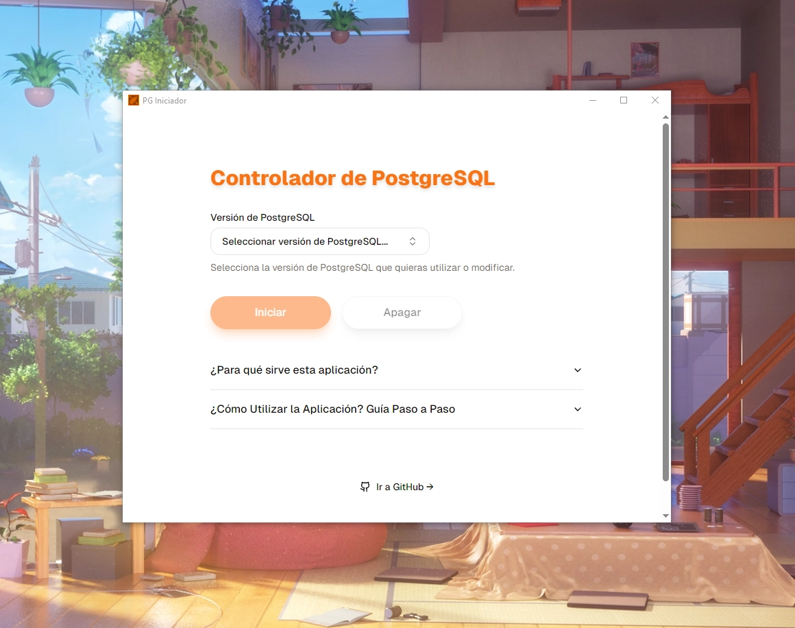
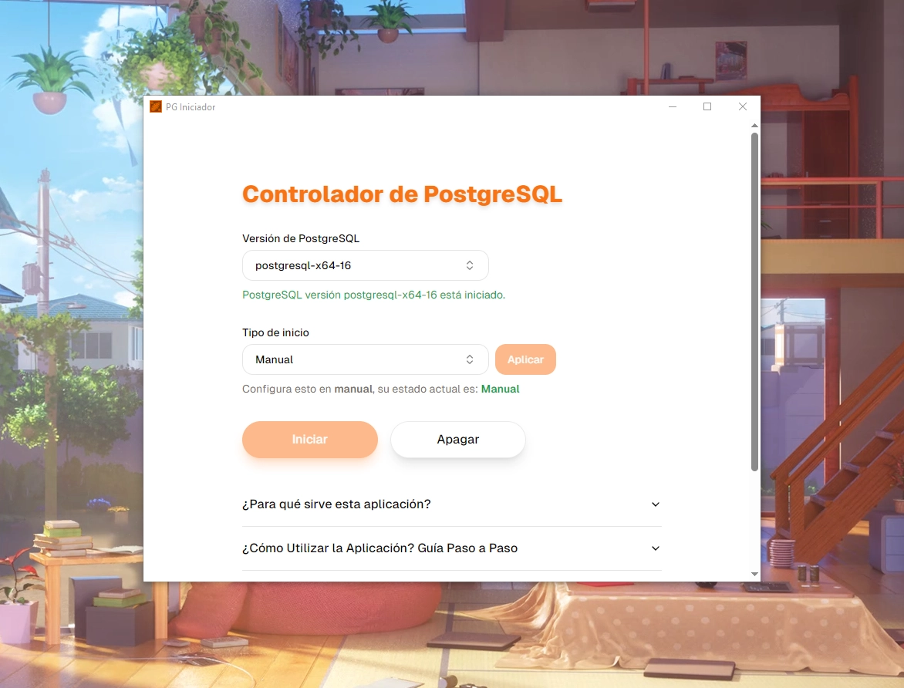

# Controlador de PostgreSQL

[]() []() []() []() []() []() []() []() 


<!-- 
[]()
[]() 
-->



**Controlador de PostgreSQL** es una aplicación diseñada para facilitar la gestión de instancias de bases de datos PostgreSQL en sistemas Windows. Permite iniciar, detener y configurar el modo de inicio del servicio de PostgreSQL de forma sencilla. Esta herramienta no está afiliada oficialmente con el proyecto PostgreSQL.

> [!NOTE]
> Puedes descargar el ejecutable desde el siguiente enlace: [PG-Iniciador.exe](https://github.com/MrSCR98/PG-Iniciador/releases/download/Ejecutable/PG-Iniciador.exe)

## ¿Cómo utilizar la aplicación? Guía paso a paso

1. **Inicia la aplicación como administrador**: Es necesario ejecutar la aplicación con privilegios de administrador para poder modificar los servicios del sistema.
2. **Selecciona la versión de PostgreSQL**: En la interfaz de la aplicación, elige la versión de PostgreSQL que deseas gestionar (iniciar, detener o configurar).

3. **Configura el tipo de inicio**: Si aún no lo has hecho, cambia el tipo de inicio a **Manual**. Por defecto, el servicio se configura en **Automático (Inicio retrasado)**, lo que puede no ser necesario si no usas PostgreSQL constantemente.

4. **Inicia PostgreSQL**: Para iniciar PostgreSQL, haz clic en el botón **Iniciar**. Esto ejecutará un comando como el siguiente:

   ```
   net start postgresql-x64-16
   ```

   

5. **Detén PostgreSQL**: Si deseas detener PostgreSQL manualmente, haz clic en el botón **Apagar**. Esto ejecutará un comando como:
   ```
   net stop postgresql-x64-16
   ```
   Aunque normalmente el servicio se detendría al apagar el equipo, esta opción te permite detenerlo de forma manual cuando lo necesites.
   

## ¿Para qué sirve esta aplicación?

La aplicación fue desarrollada para ayudar a los usuarios a gestionar las instancias de PostgreSQL en sistemas Windows, específicamente para controlar el servicio de la base de datos, el cual puede ser iniciado o detenido manualmente. Además, permite cambiar el tipo de inicio del servicio, lo cual es útil para ahorrar recursos del sistema cuando PostgreSQL no se utiliza constantemente.

Por defecto, cuando PostgreSQL se instala en Windows, el servicio se configura para iniciarse automáticamente. Aunque esto no suele consumir muchos recursos, es innecesario si no usas PostgreSQL todo el tiempo. Con esta herramienta puedes configurar el servicio para que se inicie solo cuando lo necesites.

> [!IMPORTANT]  
> La aplicación debe ejecutarse como **Administrador** para poder modificar los servicios del sistema.

> [!WARNING]  
> Al ejecutar la aplicación, es posible que tu antivirus te muestre una alerta ya que el ejecutable no está firmado. Esto ocurre porque la aplicación no está firmada por una entidad certificada. Sin embargo, puedes crear el ejecutable tú mismo siguiendo los pasos de compilación detallados a continuación. Si confías en el origen del código, puedes continuar sin problemas.

## Requisitos

Para ejecutar la aplicación, necesitas tener instalados los siguientes programas:

- **Node.js**: Asegúrate de tener la versión recomendada de Node.js instalada en tu sistema.
- **Rust**: Rust es necesario para la parte de compilación de Tauri.

## Instalación y Ejecución

Sigue estos pasos para instalar y ejecutar la aplicación en tu sistema:

1. **Instala las dependencias de Node.js**:

   ```bash
   npm i
   ```

2. **Ejecuta la aplicación en modo desarrollo**:

   ```bash
   npx tauri dev
   ```

3. **Compila la aplicación para producción**:

   ```bash
   npx tauri build
   ```

4. **Genera el icono de la aplicación** (asegúrate de tener el archivo del ícono en ./app-icon.png):

   ```bash
   npx tauri icon
   ```

## Contribuciones

Este proyecto **no es oficial** y está disponible para su mejora. Si tienes sugerencias o deseas contribuir, no dudes en abrir un **Pull Request** o reportar problemas a través de **Issues** en el repositorio.

---

¡Gracias por usar esta herramienta! Esperamos que te facilite la gestión de PostgreSQL en tu entorno de desarrollo o producción en Windows.
